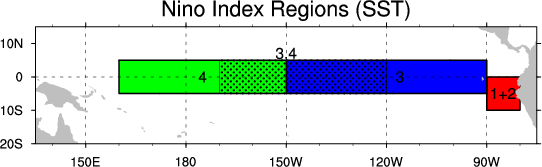

  
```{r setup, include=FALSE}
knitr::opts_chunk$set(echo = TRUE)
```


## Serie: EL NIÑO

These data constitutes of Nino Region 3 SST indices.The measurements are given in degrees Celsius. The Nino 3 Region is bounded by 90W-150W and 5S-5N.

http://www.cpc.ncep.noaa.gov/data/indices/




```{r}

ser=ts(read.csv("nino3.csv",header=F)[,1],start=1950,freq=12)
print(round(ser,1))
plot(ser)
```

```{r, include=FALSE}
measures=function(pred,obs){
  
  err=pred-obs
  perr=err/pred
  
  c(RMSE=sqrt(mean(err^2)),
    MAE=mean(abs(err)),
    nMSE=sqrt(mean(err^2))/mean(pred),
    nMAE=mean(abs(err))/mean(pred),
    RMSPE=sqrt(mean(perr^2)),
    MAPE=mean(abs(perr)))
}
```


```{r}
d12ser=diff(ser,12)
plot(d12ser)
abline(v=1950:2021,lty=3,col=4)
par(mfrow=c(1,2))
acf(d12ser,lag.max=72,ylim=c(-1,1),col=c(2,rep(1,11)))
pacf(d12ser,lag.max=72,ylim=c(-1,1),col=c(rep(1,11),2))
par(mfrow=c(1,1))
```


```{r}
(mod=arima(ser,order=c(7,0,0),seasonal=list(order=c(0,1,1),period=12)))
```

```{r,message=FALSE, warnings=FALSE}
#################Validation#################################
validation=function(model,dades){
  s=frequency(get(model$series))
  resid=model$residuals
  par(mfrow=c(2,2),mar=c(3,3,3,3))
  #Residuals plot
  plot(resid,main="Residuals")
  abline(h=0)
  abline(h=c(-3*sd(resid),3*sd(resid)),lty=3,col=4)
  #Square Root of absolute values of residuals (Homocedasticity)
  scatter.smooth(sqrt(abs(resid)),main="Square Root of Absolute residuals",
                 lpars=list(col=2))
  
  #Normal plot of residuals
  qqnorm(resid)
  qqline(resid,col=2,lwd=2)
  
  ##Histogram of residuals with normal curve
  hist(resid,breaks=20,freq=FALSE)
  curve(dnorm(x,mean=mean(resid),sd=sd(resid)),col=2,add=T)
  
  
  #ACF & PACF of residuals
  par(mfrow=c(1,2))
  acf(resid,ylim=c(-1,1),lag.max=60,col=c(2,rep(1,s-1)),lwd=1)
  pacf(resid,ylim=c(-1,1),lag.max=60,col=c(rep(1,s-1),2),lwd=1)
  par(mfrow=c(1,1))
  
  #ACF & PACF of square residuals 
  par(mfrow=c(1,2))
  acf(resid^2,ylim=c(-1,1),lag.max=60,col=c(2,rep(1,s-1)),lwd=1)
  pacf(resid^2,ylim=c(-1,1),lag.max=60,col=c(rep(1,s-1),2),lwd=1)
  par(mfrow=c(1,1))
  
  #Ljung-Box p-values
  par(mar=c(2,2,1,1))
  tsdiag(model,gof.lag=7*s)
  cat("\n--------------------------------------------------------------------\n")
  print(model)
  
  #Stationary and Invertible
  cat("\nModul of AR Characteristic polynomial Roots: ", 
      Mod(polyroot(c(1,-model$model$phi))),"\n")
  cat("\nModul of MA Characteristic polynomial Roots: ",
      Mod(polyroot(c(1,model$model$theta))),"\n")
  
  #Model expressed as an MA infinity (psi-weights)
  psis=ARMAtoMA(ar=model$model$phi,ma=model$model$theta,lag.max=36)
  names(psis)=paste("psi",1:36)
  cat("\nPsi-weights (MA(inf))\n")
  cat("\n--------------------\n")
  print(psis[1:20])
  
  #Model expressed as an AR infinity (pi-weights)
  pis=-ARMAtoMA(ar=-model$model$theta,ma=-model$model$phi,lag.max=36)
  names(pis)=paste("pi",1:36)
  cat("\nPi-weights (AR(inf))\n")
  cat("\n--------------------\n")
  print(pis[1:20])
 
  cat("\nNormality Tests\n")
  cat("\n--------------------\n")
 
  ##Shapiro-Wilks Normality test
  print(shapiro.test(resid(model)))

  suppressMessages(require(nortest,quietly=TRUE,warn.conflicts=FALSE))
  ##Anderson-Darling test
  print(ad.test(resid(model)))
  
  suppressMessages(require(tseries,quietly=TRUE,warn.conflicts=FALSE))
  ##Jarque-Bera test
  print(jarque.bera.test(resid(model)))
  
  cat("\nHomoscedasticity Test\n")
  cat("\n--------------------\n")
  suppressMessages(require(lmtest,quietly=TRUE,warn.conflicts=FALSE))
  ##Breusch-Pagan test
  obs=get(model$series)
  print(bptest(resid(model)~I(obs-resid(model))))
  
  cat("\nIndependence Tests\n")
  cat("\n--------------------\n")
  
  ##Durbin-Watson test
  print(dwtest(resid(model)~I(1:length(resid(model)))))
  
  ##Ljung-Box test
  cat("\nLjung-Box test\n")
  print(t(apply(matrix(c(1:4,(1:4)*s)),1,function(el) {
    te=Box.test(resid(model),type="Ljung-Box",lag=el)
    c(lag=(te$parameter),statistic=te$statistic[[1]],p.value=te$p.value)})))
  
  
  #Sample ACF vs. Teoric ACF
  par(mfrow=c(2,2),mar=c(3,3,3,3))
  acf(dades, ylim=c(-1,1) ,lag.max=36,main="Sample ACF")
  
  plot(ARMAacf(model$model$phi,model$model$theta,lag.max=36),ylim=c(-1,1), 
       type="h",xlab="Lag",  ylab="", main="ACF Teoric")
  abline(h=0)
  
  #Sample PACF vs. Teoric PACF
  pacf(dades, ylim=c(-1,1) ,lag.max=36,main="Sample PACF")
  
  plot(ARMAacf(model$model$phi,model$model$theta,lag.max=36, pacf=T),ylim=c(-1,1),
       type="h", xlab="Lag", ylab="", main="PACF Teoric")
  abline(h=0)
  par(mfrow=c(1,1))
}
################# Fi Validaci? #################################
```


```{r}
dades=d12ser
model=mod
validation(model,dades)
```

# Step-by-step in-sample forecast, calibration set

```{r}
npred=120

ultim=2000+11/12

pr=NULL
se=NULL

serieb=window(ser,end=ultim+npred/12)
modb=arima(serieb,order=c(7,0,0),seasonal=list(order=c(0,1,1),period=12)) 
for (i in 0:(npred-1)){
  serieb=window(ser,end=ultim+i/12)
  pred=stats:::predict.arima0(modb,1)
  pr<-c(pr,pred$pred)
  se<-c(se,pred$se)
}

pr<-ts(c(tail(window(ser,end=ultim),1),pr),start=ultim,freq=12)
se<-ts(c(0,se),start=ultim,freq=12)

tl<-ts(pr-1.96*se,start=ultim,freq=12)
tu<-ts(pr+1.96*se,start=ultim,freq=12)
pr<-ts(pr,start=ultim,freq=12)
ts.plot(ser,tl,tu,pr,lty=c(1,2,2,1),col=c(1,4,4,2),xlim=c(2000,2011),type="o",main="Model ARIMA(7,0,0)(0,1,1)12 (Calibration)")
abline(v=2000:2011,lty=3,col=4)
ts.plot(ser,pr,lty=c(1,1),col=c(1,2),xlim=c(2000,2011),type="o",main="Model ARIMA(7,0,0)(0,1,1)12 (Calibration)")
abline(v=2000:2011,lty=3,col=4)
pr1=pr
```
```{r}
(me1=measures(pr[-1],window(ser,start=ultim+1/12,end=ultim+npred/12)))
```

# Step-by-step out-of-sample forecast, validation set

```{r}
npred=120

ultim=2010+11/12

pr=NULL
se=NULL

serieb=window(ser,end=ultim)
modb=arima(serieb,order=c(7,0,0),seasonal=list(order=c(0,1,1),period=12)) 
for (i in 0:(npred-1)){
  serieb=window(ser,end=ultim+i/12)
  pred=stats:::predict.arima0(modb,1)
  pr<-c(pr,pred$pred)
  se<-c(se,pred$se)
}

pr<-ts(c(tail(window(ser,end=ultim),1),pr),start=ultim,freq=12)
se<-ts(c(0,se),start=ultim,freq=12)

tl<-ts(pr-1.96*se,start=ultim,freq=12)
tu<-ts(pr+1.96*se,start=ultim,freq=12)
pr<-ts(pr,start=ultim,freq=12)
ts.plot(ser,tl,tu,pr,lty=c(1,2,2,1),col=c(1,4,4,2),xlim=c(2010,2021),type="o",main="Model ARIMA(7,0,0)(0,1,1)12 (Validation)")
abline(v=2010:2021,lty=3,col=4)

ts.plot(ser,pr,lty=c(1,1),col=c(1,2),xlim=c(2010,2021),type="o",main="Model ARIMA(7,0,0)(0,1,1)12 (Validation)")
abline(v=2010:2021,lty=3,col=4)
pr1=pr
```
```{r}
(me2=measures(pr[-1],window(ser,start=ultim+1/12,end=ultim+npred/12)))
```


```{r}
serieTot=ser

library(neuralnet)
m=26
ny=1
mi=min(serieTot)*0.9
ma=max(serieTot)*1.1

dades=serieTot
for (i in 1:m){
  dades=ts.intersect(dades,lag(serieTot,-i))
}
dades=as.data.frame(dades)
names(dades)=paste0("y",c("",paste0("_",1:m)))
dades=(dades-mi)/(ma-mi)

set.seed(123456)
kf=1
years=10
npred=12*years
idx=c(rep(1,nrow(dades)-npred),rep(2,npred))

train=as.matrix(dades[idx!=2,])
test=as.matrix(dades[idx==2,])

resp="y"
if(ny>1) resp=paste0(resp,c("",paste0("_",1:(ny-1))),collapse="+")
expl=paste0("y_",ny:m, collapse = "+")
f <- as.formula(paste0(resp, "~",expl))

net <- neuralnet(f, train, lifesign="full",lifesign.step =5000,hidden = c(6,6),rep=1, threshold=0.00125)
plot(net)

```
```{r}

pred.train=mi+compute(net,train[nrow(train)-(npred-1):0,-c(1:ny)])$net.result*(ma-mi)
pred.test=mi+compute(net,test[,-c(1:ny)])$net.result*(ma-mi)
obs.train=mi+train[nrow(train)-(npred-1):0,1:ny]*(ma-mi)
obs.test=mi+test[,1:ny]*(ma-mi)

pr=ts(pred.train[,1],start=2021-2*years,freq=12)
ts.plot(serieTot,pr,lty=c(1,1),col=c(1,2),xlim=2021-c(2*years,years),type="o",main="NeuralNet (Train)")
abline(v=2021-years-years:0,lty=3,col=4)
pr3=pr

```
```{r}
(me3=measures(pred.train,obs.train))

```

```{r}
pr=ts(pred.test,start=2021-years,freq=12)
ts.plot(serieTot,pr,lty=c(1,1),col=c(1,2),xlim=2021-c(years,0),type="o",main="NeuralNet (Test)")
abline(v=2021-years:0,lty=3,col=4)
pr4=pr
```

```{r}
(me4=measures(pred.test,obs.test))
```


```{r}
  ultim=2010+11/12
  x=ts(tail(window(ser,end=ultim),npred),start=2001,freq=12)
  x1=ts(tail(window(ser,end=ultim-1/12),npred),start=2001,freq=12)
  x12=ts(tail(window(ser,end=ultim-12/12),npred),start=2001,freq=12)
  x13=ts(tail(window(ser,end=ultim-13/12),npred),start=2001,freq=12)
  pr=x1+x12-x13

  ts.plot(serieTot,pr,lty=c(1,1),col=c(1,2),xlim=c(2001,2011),type="o",main="Persistence")
  abline(v=2001:2011,lty=3,col=4)
  pr0A=pr
  (me0A=measures(pr,obs.train))
```

```{r}
  ultim=2020+11/12
  x=ts(tail(window(ser,end=ultim),npred),start=2011,freq=12)
  x1=ts(tail(window(ser,end=ultim-1/12),npred),start=2011,freq=12)
  x12=ts(tail(window(ser,end=ultim-12/12),npred),start=2011,freq=12)
  x13=ts(tail(window(ser,end=ultim-13/12),npred),start=2011,freq=12)
  pr=x1+x12-x13

  ts.plot(serieTot,pr,lty=c(1,1),col=c(1,2),xlim=c(2011,2021),type="o",main="Persistence")
  abline(v=2011:2021,lty=3,col=4)
  pr0B=pr
  (me0B=measures(pr,obs.test)) 
```
```{r}
cat("\nTRAIN\n")
rbind(Persistence=c(me0A),ARIMA=c(me1),ANN=c(me3))
cat("\nTEST\n")
rbind(Persistence=c(me0B),ARIMA=c(me2),ANN=c(me4))
```


